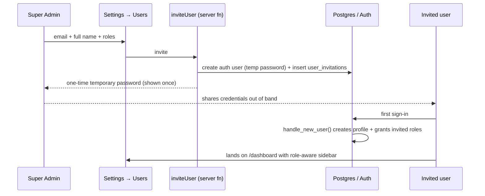
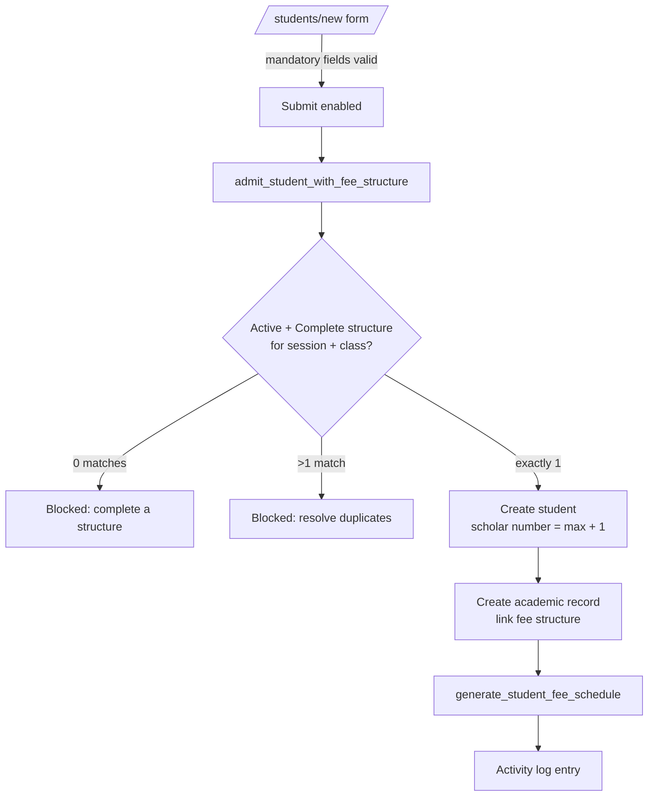
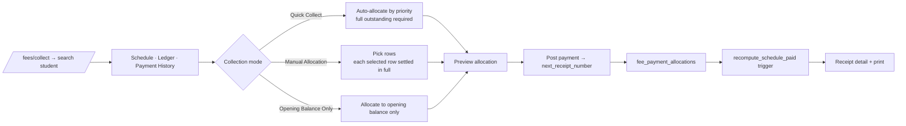

# Workflows

End-to-end operational flows as implemented. Each step notes the screen and the
database function that carries it out.

## 1. Onboarding a staff user (invitation-only)

Public sign-up is disabled. The first ever account instead calls
`claim_first_admin()` from the Dashboard banner.

## 2. Preparing an academic session

1. **Settings → Academic Sessions** — create the session as `Draft`, then
   activate it. Only one session may be `Active`
   (partial unique index + `validate_academic_session_transition`).
2. **Settings → Classes** — add classes for that session (`order_index` controls
   display order).
3. **Settings → Sections** — add sections per class (optional).
4. **Settings → Houses** — optional house master.
5. **Settings → Fee Heads** — global heads with frequency, applicable months,
   applicability, auto-generate, charge trigger, mandatory and active flags.
6. **Fees → Fee Structures** — one structure per session + class. It shows
   **Draft** until `is_fee_structure_complete()` passes, then **Complete**.
   Lock it to freeze pricing.

Admission is blocked until exactly one Active + Complete structure exists for
the session and class.

## 3. Admission

Section is optional when the class has none; roll number is optional. Documents
and the photo upload to the private `students` bucket. Bulk admission uses
`/students/import` (Excel) and reports created / skipped / failed per row.

## 4. Fee schedule generation

`generate_student_fee_schedule(record_id)` — idempotent via the unique key
`(academic_record_id, fee_head_id, period_label)`:

1. Opening balance > 0 → one `Opening Balance` row (`sort_key 0000-OPENING`).
2. Skip heads with `auto_generate = false` or `charge_trigger = 'Manual'`.
3. Applicability filter — `Optional` skipped; `NewAdmission` only for records
   with no `promoted_from_record_id`; `Existing` only for promoted records.
4. Monthly/Quarterly → one row per applicable month; **May and June are never
   generated** (tuition runs July → April). The year rolls over when the month
   is before the session start month.
5. Annual / One Time → a single row named after the fee head.
6. `sort_key = YYYY-MM-<sort_order>` drives chronological ordering.

Re-running it (the "Refresh Schedule" action) only adds missing rows.

## 5. Opening balance migration

1. **Fees → Opening Balance Migration → Manual Entry** — search a student, add
   breakup rows (previous session, fee head, amount, remarks).
2. **Bulk Import (Excel)** — download the breakup template; multiple rows per
   scholar number are combined into the single
   `student_academic_records.opening_balance`, with each row preserved in
   `opening_balance_details`.
3. **Opening Balance Report** — list, drill-down and Excel export.
4. The student ledger exposes **View Breakup** for the itemised detail.

## 6. Fee collection

Allocation priority: **Opening Balance → Admission Fee → Activities Fee →
Monthly (chronological) → Other charges (fee head sort order) → Optional**.
Partial payments are rejected in every mode. The default mode comes from
`fee_settings.default_collection_mode`.

## 7. Receipt lifecycle

1. Posting creates `fee_payments` + `fee_payment_allocations`; triggers update
   `paid_amount` and `status` on the schedule rows.
2. The receipt is reachable from the register (`/fees/receipts`), the fee
   dashboard and any list where a receipt number appears — all clickable.
3. Printing increments `receipt_print_count` and `last_printed_at`.
4. **Void** (admin / super admin) requires a reason, sets
   `is_void`/`voided_by`/`voided_at` and reverses the ledger through
   `recompute_on_payment_void`.
5. There is no edit and no delete — corrections are **void and re-post**.

## 8. Concessions

Recorded per student + session, optionally per fee head, as an amount or a
percentage, with approver and approval date. Approval is limited to admin and
principal. Concession changes reduce the outstanding of the affected schedule
rows and are written to the activity log.

## 9. Promotion

1. **Students → Promotion** — pick source session + class.
2. Choose the destination session (chronologically later only), class and
   section, and the promotion settings.
3. Set each student to **Promote**, **Retain** or **Exclude**.
4. Review the preview.
5. Commit — `bulk_promote_students()` runs as one transaction: creates the new
   academic records (`promoted_from_record_id` chains the history), links the
   fee structure and generates each schedule.
6. Roll numbers in affected classes are regenerated **alphabetically by name**
   (tie-break: scholar number).

A single-student promote dialog is available from the student profile.

## 10. Leaving and archiving

**Mark Left** captures `date_of_leaving` and `reason_for_leaving` and sets the
status. App-facing statuses are Active, Left, Passed Out and Inactive
(`Promoted`/`Transferred` are set by promotion). Archiving hides the student from
default lists without deleting anything.

## 11. Teacher record lifecycle (Super Admin only)

Create → auto employee code `NKS-0001…` → complete profile, bank and salary
details → upload documents to the private `teacher-documents` bucket → set
Active/Inactive → archive when the teacher leaves. Account numbers are masked in
the UI; documents open through signed URLs.

## 12. Audit trail

Every workflow above writes to `activity_log` through `logActivity()`
(fire-and-forget, never throws). The Activity Center (`/activity`) filters by
module, action and date and renders human-readable summaries via
`formatActivityDetails()`. The log is append-only.
